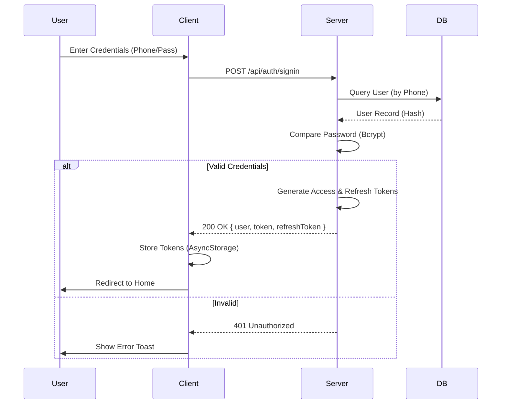
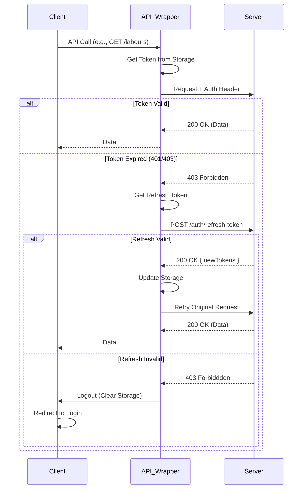
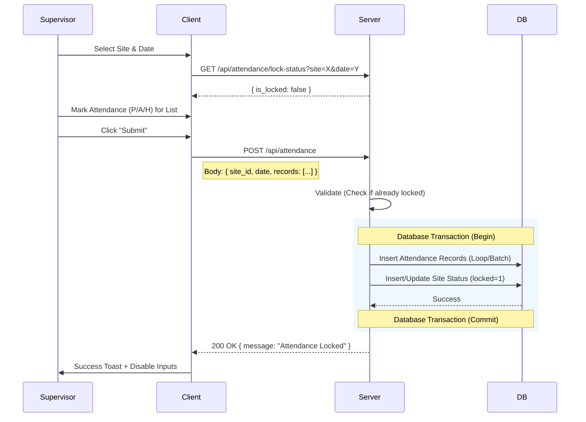
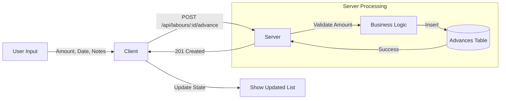
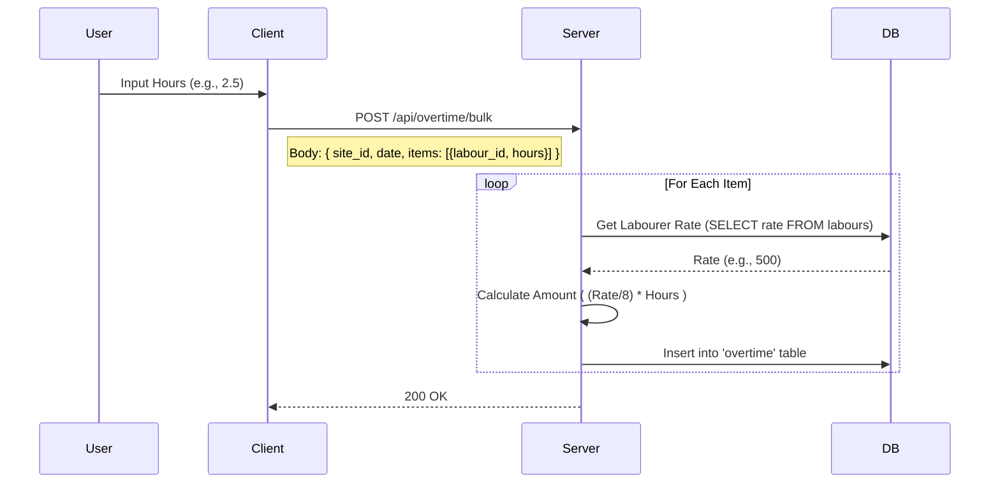
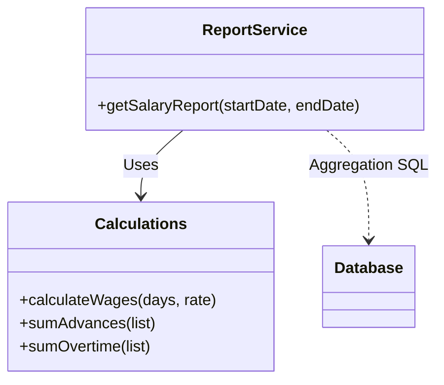
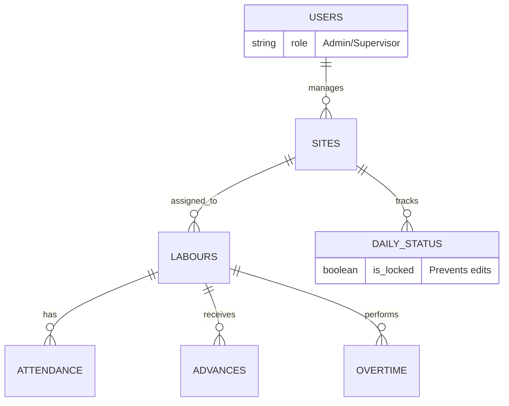

# Data Flow Documentation

This document provides a deep dive into the data flow within the application, designed to help future developers understand how data moves through the system, from the user interface to the database and back.

> **Note**: To view the diagrams in this document, use a Markdown viewer that supports [Mermaid](https://mermaid.js.org/) (like GitHub, GitLab, or VS Code with the Mermaid extension). To create a PDF, you can export this Markdown file using a "Markdown to PDF" converter.

---

## **1. System Overview**

The application follows a standard **Client-Server-Database** data flow pattern.

*   **Client (React Native)**: Initiates requests and renders data.
*   **Server (Node.js/Express)**: Validates requests, executes business logic, and interacts with the database.
*   **Database (SQLite)**: Stores persistent data relatonally.

### **Global Data Lifecycle**
1.  **User Interaction**: User performs an action (e.g., clicks "Submit").
2.  **Client State**: React state updates; input validation occurs.
3.  **API Request**: `Axios` (or custom fetch wrapper) sends an HTTP request with JSON payload.
    *   *Header*: `Authorization: Bearer <token>` is attached.
4.  **Server Middleware**:
    *   `cors`: Allows cross-origin requests.
    *   `json`: Parses body content.
    *   `authenticateToken`: Verifies JWT validity.
5.  **Controller Logic**:
    *   Validates business rules (e.g., "Is date locked?").
    *   Constructs SQL queries.
6.  **Database Execution**: `sqlite3` driver executes the query (often within a transaction).
7.  **Response**: Server sends JSON response (Data or Success Message).
8.  **Client Update**: UI updates based on response (e.g., Toast message, list refresh).

---

## **2. Authentication & Session Flow**

Security is handled via **JSON Web Tokens (JWT)**. There are two token types:
*   **Access Token**: Short-lived (e.g., 1 hour), used for API requests.
*   **Refresh Token**: Long-lived (e.g., 7 days), stored securely to obtain new access tokens.

### **2.1 Login Flow**

### **2.2 Authenticated Request & Token Refresh**
This flow handles automatic token refreshing when the Access Token expires.

---

## **3. Feature-Specific Data Flows**

### **3.1 Attendance Marking (Bulk Action)**
This is a critical flow involving bulk updates and site locking.

### **3.2 Advance Payments**
Recording a cash advance given to a labourer.

### **3.3 Overtime Submission**
Recording extra hours. The server calculates the amount based on the labourer's wage rate **at the time of submission** (or current rate), ensuring historical accuracy if rates change later.

### **3.4 Salary Report Generation**
How the system calculates final payable amounts.

1.  **Input**: Start Date, End Date.
2.  **Aggregation Queries**:
    *   **Wages**: `COUNT(attendance) * Rate` (Filtered by 'Present'/'Half').
    *   **Overtime**: `SUM(overtime.amount)`.
    *   **Advances**: `SUM(advances.amount)`.
3.  **Calculation**: `Total = Wages + Overtime - Advances`.

---

## **4. Error Handling & Edge Cases**

### **4.1 Network Errors**
*   **Scenario**: User is offline or server is down.
*   **Flow**:
    1.  `fetch` throws exception.
    2.  `api.ts` catches error.
    3.  Client displays generic "Network Error" or "Please check connection".
    4.  **No Offline Mode**: Currently, the app requires internet to function. Data is not queued locally (V1 limitation).

### **4.2 Data Integrity Locks**
*   **Scenario**: Two supervisors mark attendance for the same site same day.
*   **Protection**:
    *   Database constraint on `daily_site_attendance_status (site_id, date)`.
    *   Transaction isolation prevents partial writes.
    *   Once `locked=1`, the API rejects further POST requests for that date/site.

### **4.3 Validation**
*   **Frontend**: React logic prevents submitting empty forms or negative numbers.
*   **Backend**: `express-validator` or manual checks ensure inputs are sanitized and valid types before hitting the DB.

---

## **5. Database Relationships (ERD Reference)**

A simplified view of how data connects to support the flows above.

